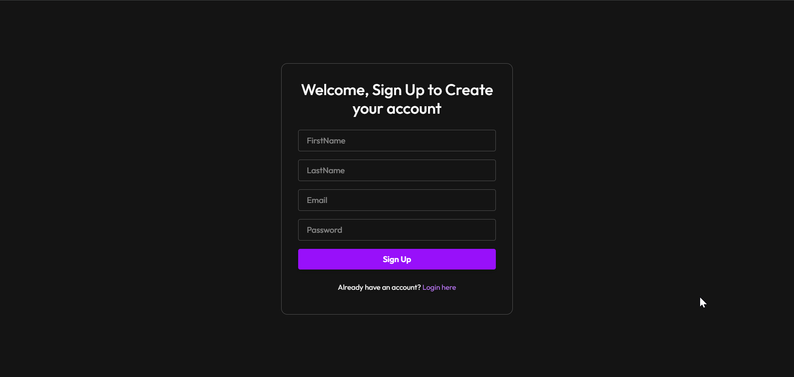
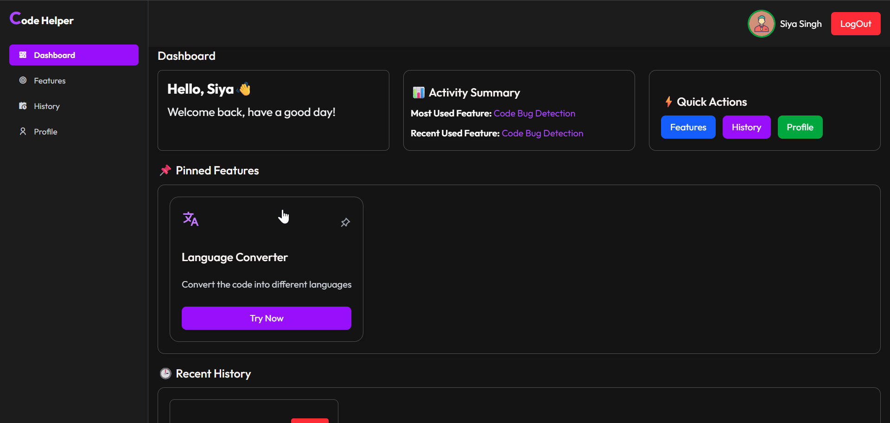
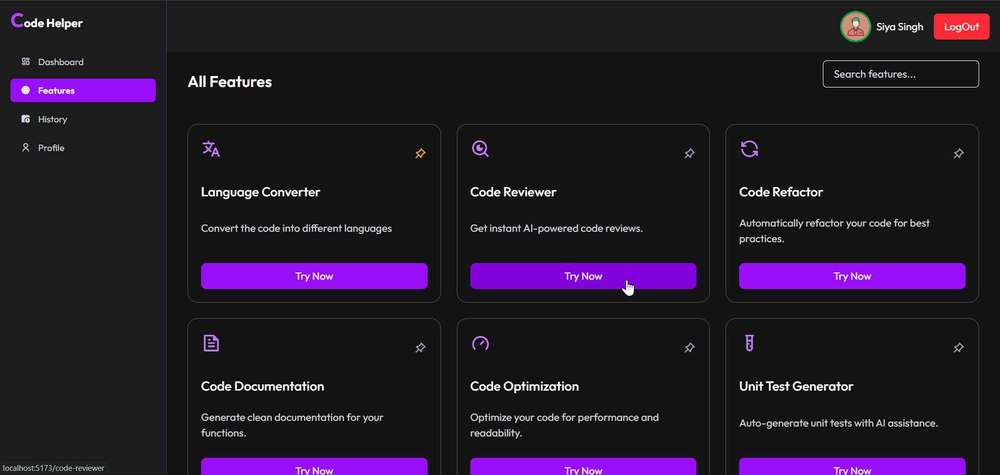
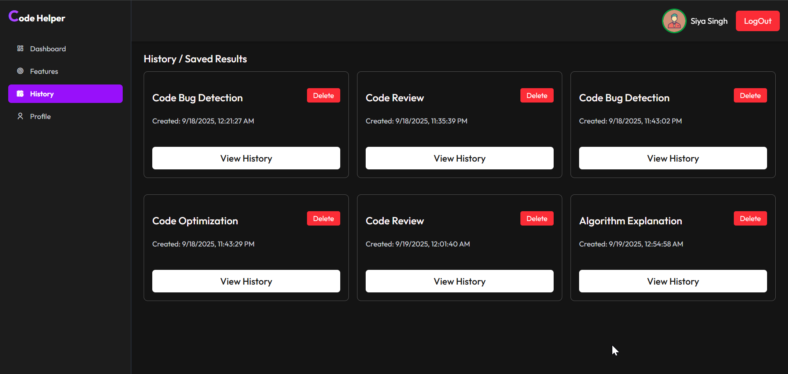
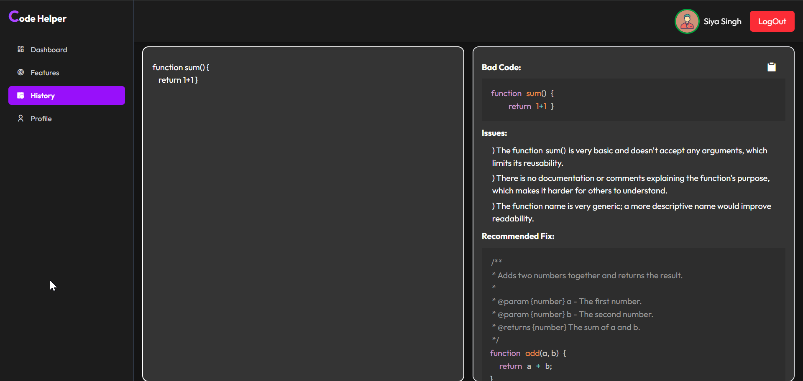

<div align="center">

# Code Helper - AI powered coding assistant

Code Helper is an AI-powered web app that helps developers in real time.
It can review your code, suggest optimizations, find bugs, explain algorithms, convert code between languages, refactor code, and also generate unit tests.

The app uses the Google Gemini API to give smart suggestions and comes with an interactive coding environment powered by the Monaco Editor.


</div>

---

# ✨ Features

- 🔐 **JWT Authentication** – Secure signup & login

- 🤖 **AI Assistance** – Code review, bug detection, optimization, refactoring, documentation, unit tests, algorithm explanation and language conversion

- ⚡ **Real-time Suggestions**– Powered by Google Gemini API

- 📜 **User History** – Track previously used features


# 🚀 Getting Started

## 🔧 Prerequisites
- Node.js (v18+ recommended)
- npm (comes with Node.js)
- MongoDB (local or Atlas)
- A Google Gemini API Key

## 📥 Clone the Repository
```bash 
git clone https://github.com/Nanditabisaria13/Code-Helper.git
cd code-helper
```

## ⚙️ Backend Setup
```bash
cd backend
npm install

# Create a .env file inside backend/ with:

MONGO_URI=your_mongodb_connection_string
JWT_SECRET=your_jwt_secret_key
GEMINI_API_KEY=your_google_gemini_api_key
```

## 🎨 Frontend Setup (Vite + React)
```bash
cd frontend
npm install

# Create a .env file inside frontend/ with:
VITE_BACKEND_URL= http://localhost:3000
```
## Run the Application
```bash
# Run backend
npm run server

# Run frontend
npm run dev

```
# Access the Application

- Frontend: `http://localhost:5173`
- Backend: `http://localhost:3000`


# 📷 Screenshots

Home Page
 

Sign Up Page

Dashboard Page


Feature Page


AI Response


History Page


ViewHistory Page



# 🛠 Tech Stack

- **Frontend**: React, Vite, Tailwind CSS, Monaco Editor, React Markdown
- **Backend**: Node.js, Express.js
- **Database**: MongoDB
- **Authentication**: JWT (JSON Web Token)
- **AI Integration**: Google Gemini API


# 🖥️ Usage

-  Open the application in your browser.

-  Write or paste your code into the Monaco editor.

-  Select the action you want (Review, Refactor, Optimize, Convert, etc.).

-  Get AI-powered suggestions and improvements in real-time.

# 🤝 Contributing

Contributions are welcome! Please fork the repo and submit a pull request.